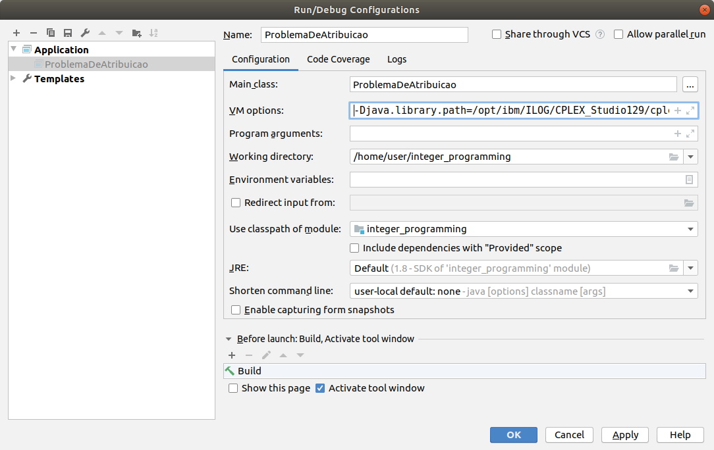

# integer_programming

This is a example for: how to run IBM CPLEX in Java.

In order to make the cplex.jar as maven project dependency, using maven-assembly-plugin with jar-with-dependencies property, run the follow command:
~~~~
mvn install:install-file \
    -Dfile=/opt/ibm/ILOG/CPLEX_Studio129/cplex/lib/cplex.jar \
    -DgroupId=cplex \
    -DartifactId=cplex \
    -Dversion=12.9.0.0 \
    -Dpackaging=jar
~~~~

To execute the program with maven run:
~~~~
mvn clean install exec:java
~~~~

To execute this program on IntelliJ without maven (exec:java), set the **VM options** on **Run/Debug Configurations**:
~~~~
-Djava.library.path=/opt/ibm/ILOG/CPLEX_Studio129/cplex/bin/x86-64_linux
~~~~

## Requirements and/or advices

* This tutorial is based on Ubuntu 18.04.3 LTS edition
* The IBM ILOG CPLEX Optimization Studio is installed on /opt/ibm
* The Maven is used as project management to:
    * manage dependencies,
    * assembly,
    * and exec the program
* It is high recommended to use the IntelliJ IDEA Community Edition

Code created by Alexandre da Silva Freire